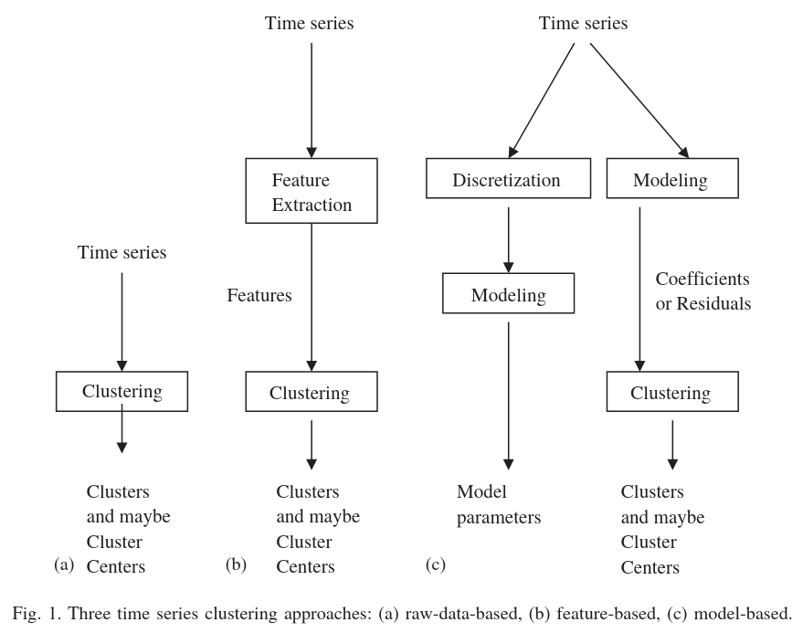

#+Title: To-Do
* To-Do
** Code
*** TODO Check code for bugs with some LLM
*** DONE Trick for SPD(semi positive definite) \to $\frac{1}{2}(A + A^{\top})$
Doesn't change anything
*** Remove diagonal covariance constraint
Full covariance may improve the modeling of the data
** Questions
*** DONE Plot x1, x2 instead of PCs to see if it is well separated
*** TODO Does supervised data actually steer the clusters positions?
** Poor classification
*** DONE Play with $\beta$ and number of supervised data points
*** DONE Increase window size
*** Try scaling the training data
**** Not scaling but mapping, i.e. not dividing by sigma
*** Featurization & windowing
**** Why?
***** Clustering based on raw data implies working with highdimensional space—especially for data collected at fast sampling rates. It is also not desirable to work directly with the raw data that are highly noisy.

**** TODO Add more features
**** Study which features to keep
**** Don't use feature & windows?
Seems that features and windows make it worst that no features at all
**** DONE Move windows one point at a time
Already the case
**** Dimensionality reduction after featurization?
* Next
** DONE Visualize uncertainty on new data
** DONE Add 5 observations instead of 2
** Try on real data with features/windows and without

* Practical implementation for writing
** When demoing, select some points auto and save with known segment from symbolic planner
